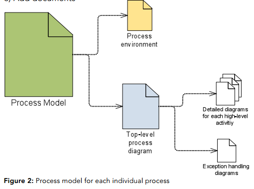

# BPMN 2.0

## Title
>>> #  Effective Process Modeling with BPM & BPMN

## Categories
- [About business Process Management](#About-business-Process-Management)
  - [BPM Business Process Lifecycle](#BPM-Business-Process-Lifecycle)
- [BPM Modeling](#BPM-Modeling)
- [](#)
- [](#)


## Contents

### About business Process Management
BPM (Business Process Management) is a set of related 
activities, such as process modeling and design, process 
execution, process monitoring, and process optimization. This 
Refcard provides an overview of the BPM lifecycle together 
with the roles and results of business process modeling. It 
gives an overview of the BPMN (Business Process Modeling 
Notation) and presents the most important BPM patterns.

### BPM Business Process Lifecycle
	* Process modeling
	* Process implementation 
	* Process execution and monitoring
	* Process simulation
	* Process optimization
Note:
```
KPIs are financial and non-financial metrics used to 
help an organization define and measure process 
efficiency. Examples of a KPI are “Average revenue 
per customer”, “Average time for response to a 
customer call”, “ Average order amount”, etc.
```

Note:
```
Business activity monitoring (BAM) is real-time
observation of key performance indicators.
```

### BPM Modeling
>>> #### Why do we Model Business Processes?

1. Design new business processes
	```
	Focus on business goals, KPIs, customer needs, and business partner 
	expectations.
	```
2. Model existing business processes
	```
	Assure the right flow of activities.
	Identify normal flows and possible exceptional flows.
	Identify inputs and outputs of activities.
	Identify key documents and sources.
	Identify business rules.
	```
3. Restructure existing business processes
	```
	Focus on the activities and their added value.
	Focus on lines of business and their relations.
	Model responsibilities and roles.
	```
4. Development of endto-end IT support for 
	```
	business processes
	Detailed modeling of process flow.
	Detailed modeling of data, documents, business objects, and 
	interfaces.
	Detailed exception handling
	```	
	
>>> #### Who should take part in process modeling?
The team should include different profiles and encourage 
looking at the process from different angles. This is particularly 
important for optimizations. Four to six people is usually an 
optimal team size. The following table lists the various profiles 
that should comprise the team:

1. Line of Business Expert
	```
	Good, in-depth knowledge of the process.
	```
2. Process Owner 
	```
	Responsible for the overall execution of the process, approves process 
	modifications.
	```
3. Moderator 
	```
	Responsible for the meeting, for asking questions for leading the 
	discussion into the right direction.
	Modeling Expert Responsible for design the process model (during and after the meeting).
	```
4. QA Owner 
	```
	Responsible for the alignment of processes in aspect of total quality 
	management. 
	```
>>>> #### How do we model?

1. Top-down
* Approach
	```
	We start with the process architecture. 
	First we identify the major process 
	activities and their flow. Then we model 
	each activity into more detail.
	```
*  Problem
	```
	• High level process modeling 
	requires good knowledge about the
	process and some experience.
	• Modeling lower levels can reveal 
	inconsistencies on higher-levels.
	```
2. Bottom-up 
* Approach
	```
		We start with the identification of 
		activities. We model sub processes and 
		business transactions and merge them 
		into processes.
	```
* Problem
	```
	• We get lost in the details. 
	• Getting overview of processes 
	and their relations can become very 
	difficult.
	• We can focus on too many details.
	```
2. Inside-out 
* Approach
	```
	We start with core processes. We 
	expand them with adding support 
	processes around core processes.
	```
* Problem
	```
	• It can be difficult to identify core 
	processes and how to progress into 
	the right direction
	```
* Note:
	```
	The Inside-out approach is usually the most 
	pragmatic approach to prcess modeling. Provide a 
	brief explanation of why it is the most pragmatic 
	approach.
	```
	
>>>> #### How to approach designing a process model

We should model the process to understand the detailed 
structure of it. We should identify at least the following:

	• Process activities, on various levels of details (depending 
	on the selected approach)
	• Roles responsible for carrying-out the process activities
	• Events, which trigger the process execution and events 
	that interrupt the process flow
	• Input and output documents exchanged within the 
	process
	• Business rules that are part of the process

Below is the most conventional approach for designing a 
process model, in order of occurrence:

